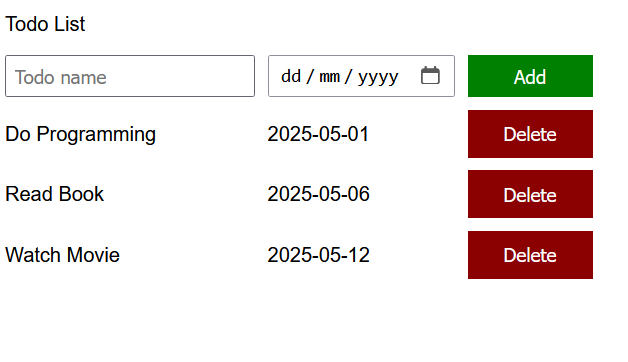
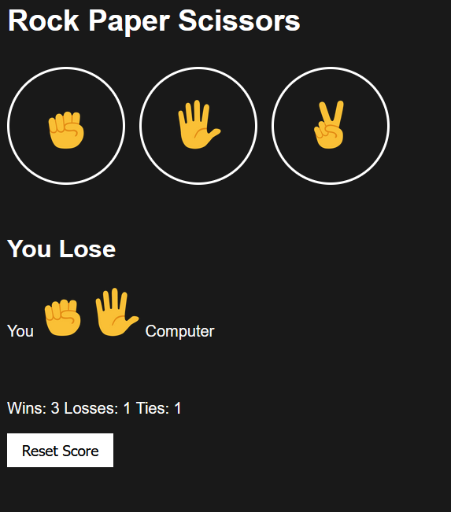

# JavaScript Projects

This repository contains two beginner-friendly JavaScript projects built using **HTML**, **CSS**, and **JavaScript**:

1. [Todo List](./todo-list)
2. [Rock Paper Scissors Game](./rock-paper-scissors)

Each project is self-contained in its own folder with all necessary files.

---

## 📁 Projects Overview

### 1. ✅ Todo List

A simple and interactive todo list web app that allows users to:
- Add new tasks
- Delete tasks

#### 🔧 Features:
- Dynamic DOM manipulation
- Data persistence using localStorage (optional)
- Clean and responsive UI

#### 📸 Screenshot:


> Make sure you upload the screenshot image as `todo-list/screenshot.png` in the respective folder or update the path.

---

### 2. ✊✋✌️ Rock Paper Scissors

A classic Rock-Paper-Scissors game where you play against the computer. The result is shown based on your choice and a randomly generated computer choice.

#### 🔧 Features:
- Basic game logic using JavaScript
- Random choice generation
- Score tracking (optional)
- Simple animations and transitions

#### 📸 Screenshot:


> Upload the screenshot image as `rock-paper-scissors/screenshot.png`.

---

## 🚀 How to Run the Projects

1. Clone the repository:

```bash
git clone https://github.com/your-username/your-repo-name.git
